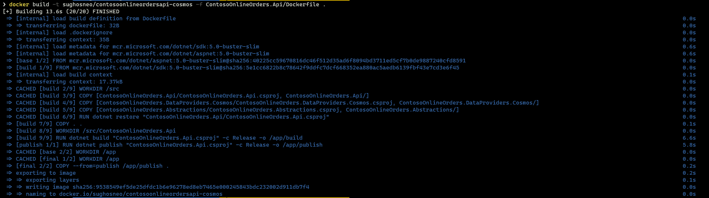
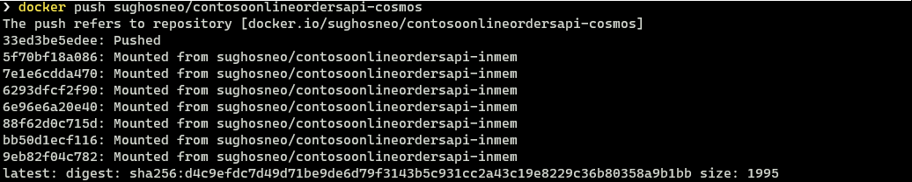
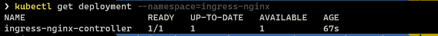
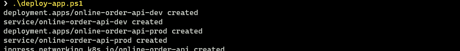
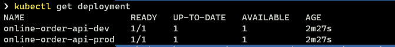

# Contoso.Online.Orders
The .NET 5 version of Contoso Online Orders API. 

# Deploying order api to Kubernetes

- All the K8s related scripts are kept under **deploy/k8s** directory.
- It has 3 different directories :
    - `ingress-controller` - contains all yamls for the nginx-ingress controller for the k8s cluster.
    - `dev` - contains necessary yaml for the dev version of the `contoso online order api`
    - `prod` - contains necessary yaml for the dev version of the `contoso online order api`
    
    > !NOTE : Each yaml includes both  `deployment` and `service` segment.


- It also has 2 following powershell scripts :
    - `deploy-ingress.ps1` - helps in deploying the ingress controller for the k8s cluster.
    - `deploy-app.ps1` - helps in deploying the app in the k8s.  

Before running any script you need to make sure you have the following configuration for both `dev` and `prod` version of the API.

### Configuration with in-memory cache - (Dev - version)

- By default the api uses in memory datastore. For e.g :

    ```csharp
    services.AddMemoryCache();
    services.AddSingleton<IStoreDataService, MemoryCachedStoreServices>();
    
    //services.AddCosmosDbStorage(Configuration.GetConnectionString("ContosoOrdersConnectionString"));    
    ```

- And then like above you need to generate a new docker image and publish to the dockerhub to use it for k8s specific deployment.
- You can use below commands for that :

    ```text
    docker build -t <YOUR-DOCKERHUB-ID>/contosoonlineordersapi -f ContosoOnlineOrders.Api/Dockerfile .
    
    docker push <YOUR-DOCKERHUB-ID>/contosoonlineordersapi    
    ```

### Configuration with Azure Cosmos as persistent data store - (Prod - version)

- To use a persistent data store you need to enable Azure Cosmos DB connection string. And you also need to comment out the in memory cache. For e.g :

    ```csharp
    //services.AddMemoryCache();
    //services.AddSingleton<IStoreDataService, MemoryCachedStoreServices>();
    
    services.AddCosmosDbStorage(Configuration.GetConnectionString("ContosoOrdersConnectionString"));    
    ```
- Go to the directory `Contoso.Online.Orders`
- Login to the dockerhub (docker.io) and keep your **YOUR-DOCKERHUB-ID** handy you need that in the next step. 
- Run below command :

    ```text
    docker build -t <YOUR-DOCKERHUB-ID>/contosoonlineordersapi-cosmos -f ContosoOnlineOrders.Api/Dockerfile .
    ```

- Build steps should look like as per below :

    

- Once it gets built successfully push that to the dockerhub repository. You could do that by using the following command :

    ```text
    docker push <YOUR-DOCKERHUB-ID>/contosoonlineordersapi-cosmos
    ```

    
    
- You need to make changes in the respective k8s yaml file as well to point to the right docker repository. In this case file name is `apideploy-prod.yaml` under **k8s\prod** directory.

- You will also need to update the `ConnectionStrings__ContosoOrdersConnectionString` environment variable to point it to the right Azure Cosmos DB instance.

### Deployment 

- Go to the directory **Contoso.Online.Orders/deploy/k8s**
- And first run script `deploy-ingress.ps1` to deploy the ingress controller for the k8s cluster. 
- Wait for sometime, to let the ingress controller be ready. 
- You can verify that using the command 

    ```powershell
    kubectl get deployment --namespace=ingress-nginx
    ```
    
    

- Then run the actual app deployment script `deploy-app.ps1`
    
    

- Then you can verify the if all the services are up and running. 
    
    

- 
### Check services

- Now you can use respective services using the following urls
    -  `http://<EXTERNAL-IP>/dev/swagger>`
    -  `http://<EXTERNAL-IP>/prod/swagger>`

> !NOTE : for the local k8s cluster the value of `<EXTERNAL-IP>` is `localhost`.


